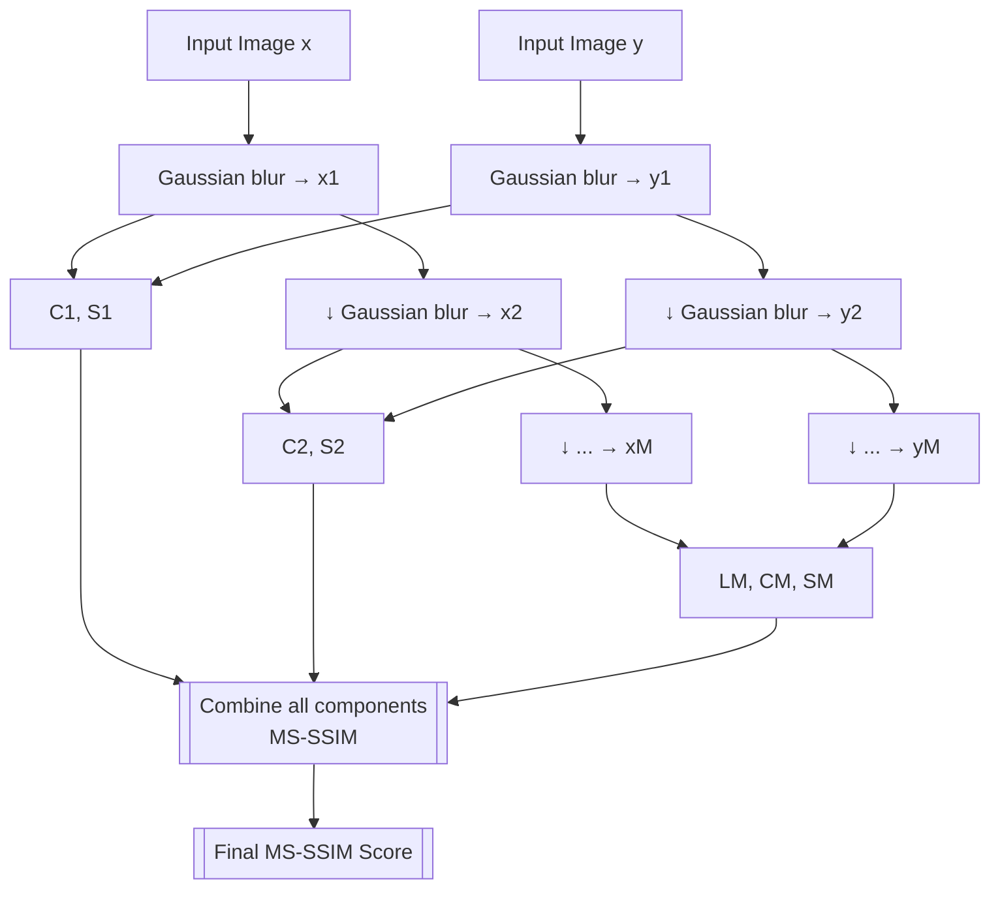

# Video Quality Assessment
### Learning Progress Report  
James Hsu  
May 9th 2025

---

## Learning Goals and Topics

- Explore how visual quality metrics quantify distortion and compression
- Understand DCT, SSIM, MS-SSIM, VMAF and their mathematical basis
- Analyze motion coherency and temporal NSS models for temporal consistency
- Simulate video sequences from static images and extract statistical features

---

## PSNR & SSIM Fundamentals

- **PSNR**: Measures pixel-level error using peak signal-to-noise ratio  
  ${PSNR} = 10 \cdot \log_{10} \left( \frac{MAX^2}{MSE} \right)$

- **SSIM**: Structural Similarity Index considering luminance, contrast, structure  
  $SSIM(x,y) = l(x,y) \cdot c(x,y) \cdot s(x,y)$

- My Question:
  - Compared additive vs multiplicative combinations for smoothness (e.g. Why use MSE in PSNR but use $l(x, y) = \frac{2\mu_x \mu_y + C_1}{\mu_x^2 + \mu_y^2 + C_1}$ in SSIM?)

- My guess
  - If both images are scaled by the same factor (e.g., made uniformly brighter), it won’t significantly affect their similarity
  - Compared to simply using the absolute difference $|\mu_x - \mu_y|$, using a ratio-based method is more tolerant of slight brightness differences

---

## PSNR & SSIM Fundamentals (Continued)

---

## MS-SSIM and Gaussian Blurring

- **Multi-Scale SSIM**: Extends SSIM across different spatial scales

- Downsampling is applied via Gaussian blur → image pyramid 

- Only the last level uses luminance comparison; others use contrast and structure

- My Question
  - Why use Gaussian blur instead of other downscaling or noise methods?

- My Guess
  - A low-pass filter should be applied before each downsampling step
	- Otherwise, high-frequency signals can alias into lower frequencies, resulting in unnatural artifacts or texture distortions

---

## MS-SSIM and Gaussian Blurring (Continued)

---

## MS-SSIM and Gaussian Blurring (Continued)

---

## Gabor Filter & V1 Visual Cortex Modeling

- Gabor filter formula  
  
  $g(x,y) = \exp\left( -\frac{x'^2 + \gamma^2 y'^2}{2\sigma^2} \right) \cdot \cos\left( 2\pi \frac{x'}{\lambda} + \phi \right)$

- $\gamma$: ellipticity, simulates orientation bias in V1 neurons  
- $\phi$: even-symmetric vs odd-symmetric → sensitive to stripes vs edges  
- Applied Gabor filtering to images to analyze local orientation patterns

---

## Gabor Filter & V1 Visual Cortex Modeling (Continued)

- First Row: Stripe Input (e.g., regular wall textures)
	- φ = 0 (cosine, even symmetry): The stripes align with the filter’s pattern ⇒ strong response, clear oscillation
	- φ = π/2 (sine, odd symmetry): The stripes align with the filter’s zero crossings ⇒ signal cancels out on both sides, resulting in a very weak response

- Second Row: Edge Input (brightness transition)
	- φ = 0 (even symmetry): The edge falls in regions of opposite sign in the filter ⇒ moderate response due to partial cancellation
  - φ = π/2 (odd symmetry): The edge aligns with the filter’s zero crossing ⇒ positive/negative regions align with bright/dark areas ⇒ strongest response

- Third Row: Bright Region Input (uniform brightness area)
	- Both filters produce little to no response
---

## Gabor Filter & V1 Visual Cortex Modeling (Continued)

---

## Blind Image Integrity Notator using DCT Statistics（BLIINDS)
 
- **DCT**: Discrete Cosine Transform is used to convert a signal from the spatial domain (e.g., an image) to the frequency domain  
  $\cos\left[ \frac{\pi}{N}(x+0.5)u \right]$: projects onto orthogonal cosine basis
- **GGD**: Generalized Gaussian Distribution  
  $f(x; \alpha, \beta) = \frac{\beta}{2\alpha\Gamma(1/\beta)} \cdot \exp\left( - \left( \frac{|x|}{\alpha} \right)^{\beta} \right)$

| Parameter |	Value Range	| Distribution Shape |	Interpretation (Applied to Images) |
|  ----  | ----  | ---- | ---- |
| $\beta = 2$ |	Gaussian |	Smooth in flat regions, weaker edges |	Indicates natural texture with no strong compression or noise |
| $\beta < 1$ |	Heavy-tailed |	Sharper peaks, more noise or abrupt changes |	Suggests presence of compression artifacts or strong edges |
| $\alpha$ | Any positive value |	Controls overall spread |	Can reflect image contrast or texture richness |

- My Question:
  - Why using GGD for the model, not GMM (Gaussian Mixture Model), GSM (Gaussian Scale Mixture)? 

---

## Blind Image Integrity Notator using DCT Statistics（BLIINDS)

- My Question:
  - Why using GGD for the model, not GMM (Gaussian Mixture Model), GSM (Gaussian Scale Mixture)? 

---

## Thank You