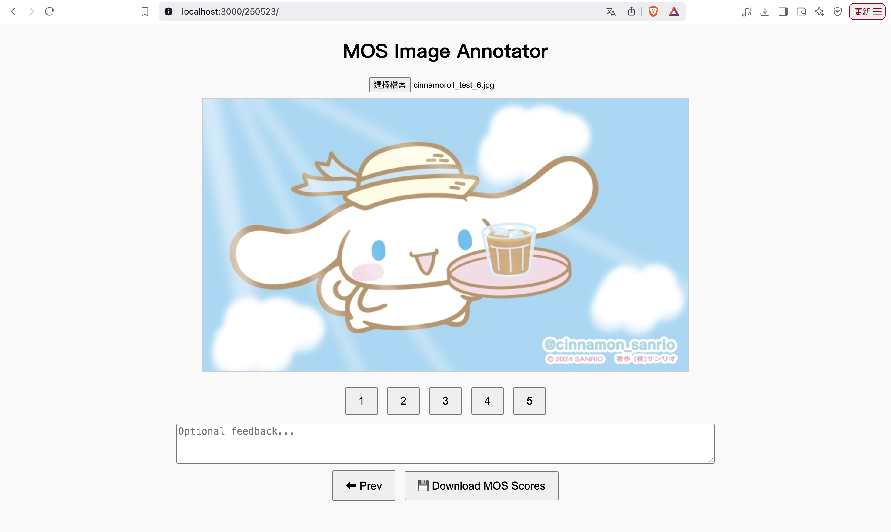
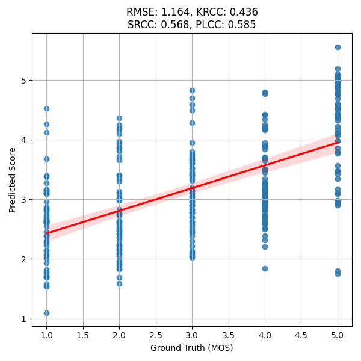
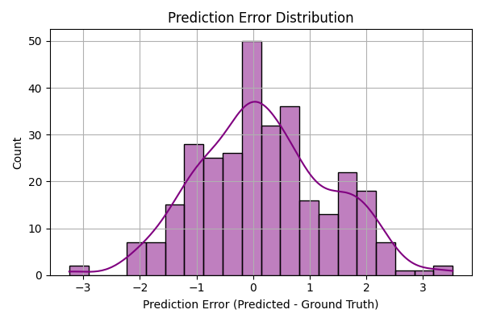
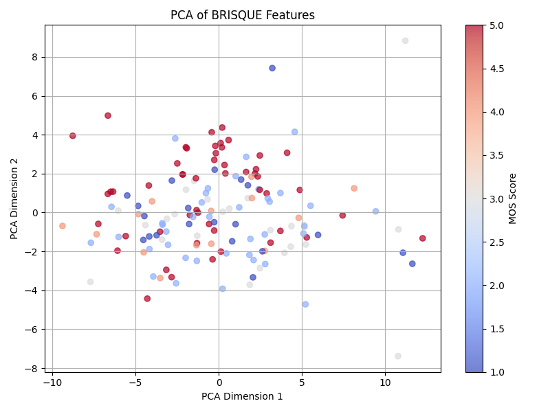
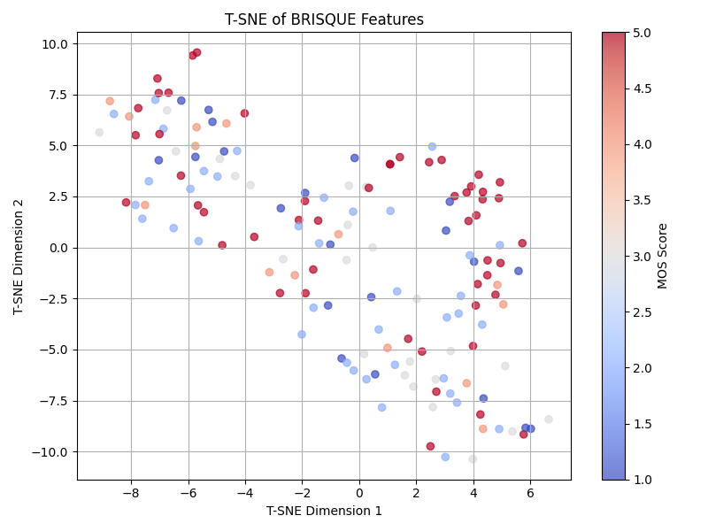
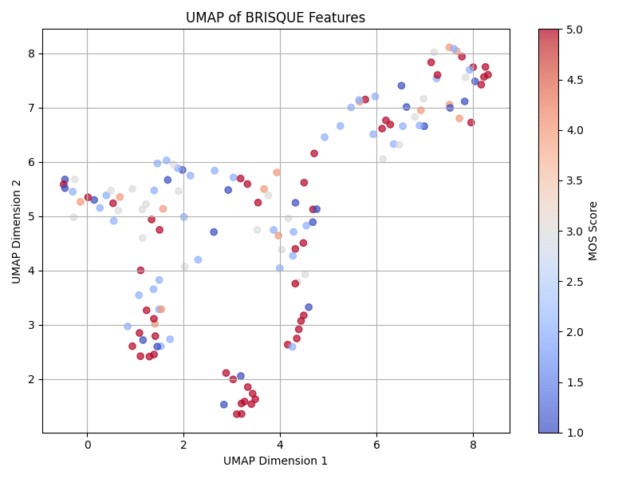
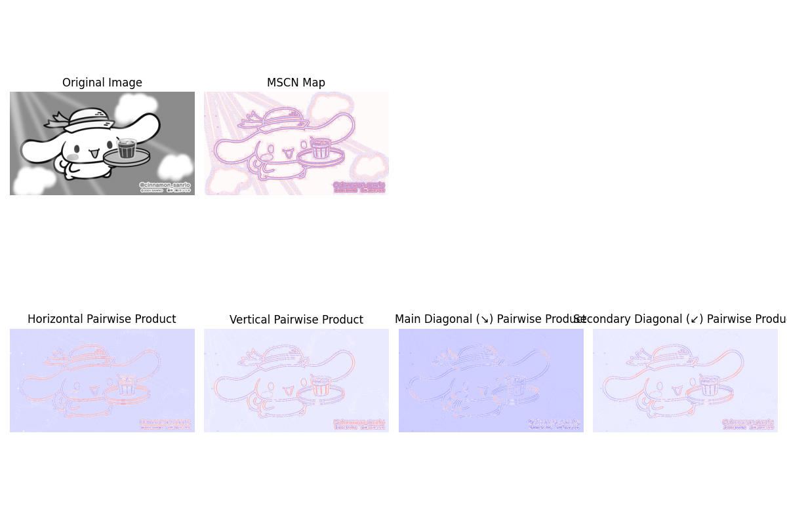

# BRISQUE Image Quality Assessment
This project provides a full pipeline for **blind image quality assessment (BIQA)** based on the BRISQUE model, including:

- Training on your own dataset (e.g. cartoon or illustration like Cinnamoroll)
- Visualization of model attention and feature embeddings
- Evaluation with correlation metrics and exportable result reports
- Integration with [MOS annotation tool](index.html)

---

## File Overview

| File                             | Description                                               |
|----------------------------------|-----------------------------------------------------------|
| `brisque.py`                     | Feature extraction core + CLI modes                       |
| `index.html`                     | Web-based image annotator to collect MOS scores           |
| `mos_scores.txt / csv`           | Your annotated dataset with image name, score, comment    |

---

## Getting Started

### 1. Install Dependencies

```bash
pip3 install -r requirements.txt
```

---

### 2️. Annotate Your Dataset

Use `index.html` to label your images with MOS (Mean Opinion Score):

```bash
# Open in browser
open index.html
```

- Upload your images
- Score each one (1–5)
- Click 💾 to download `mos_scores.csv`



---

### 3️. Train Your Own BRISQUE Model

```bash
python brisque.py --mode train --csv mos_scores.csv --image_dir images/
```

This will train a Support Vector Regressor (`SVR`) model based on 28D BRISQUE features and save as `brisque_model.pkl`.

---

### 4️. Evaluate on Test Set

```bash
python brisque.py --mode evaluate --csv mos_scores_test.csv --image_dir test_images/
```

This will:

- Predict BRISQUE scores on test set
- Export `evaluation_results.csv`
- Plot:
  - `prediction_vs_groundtruth.png`
  - `prediction_error_distribution.png`




---

### 5️. Visualize Feature Structure

#### PCA / t-SNE / UMAP

```bash
python brisque.py --mode analyze --csv mos_scores.csv --image_dir images/
```





---

### 6️. Visualize What BRISQUE Cares About

#### 🎨 Component Maps

```bash
python brisque.py --mode visualize --test_image path/to/image.jpg
```

Shows:
- Original image
- MSCN map
- Horizontal / Vertical / Diagonal pairwise product maps



#### 7. Patch-wise Heatmap

```bash
python brisque.py --mode heatmap --test_image path/to/image.jpg
```

Generates a heatmap showing which patches contribute more to BRISQUE score.

---

## 📊 Metrics Used

| Metric     | Meaning                                         |
|------------|--------------------------------------------------|
| `Root Mean Square Error（RMSE)`     | Measures **the average error** between predicted values and subjective MOS scores                          |
| `Spearman Rank-Order Correlation Coefficient (SRCC)` | Measures **monotonic relationships** between predicted scores and subjective Mean Opinion Scores (MOS).                    |
| `Pearson Linear Correlation Coefficient (PLCC)`  | Measures **linear correlation** between predicted scores and MOS                               |
| `Kendall Rank Correlation Coefficient (KRCC)`  | Measures **pairwise ranking agreement**             |

---

## Tips

- BRISQUE is originally designed for natural photos; retraining is essential for non-natural content (e.g. anime, CG).
- Use `analyze`, `tsne`, or `umap` to inspect feature separability in your dataset.
- You can use your MOS-labeled cartoon set to fine-tune BRISQUE for stylized domains.

---

## Citation (if needed)

If you use this framework for publication, please cite the original BRISQUE paper:

> A. Mittal, A. K. Moorthy and A. C. Bovik, "No-Reference Image Quality Assessment in the Spatial Domain," in IEEE Transactions on Image Processing, vol. 21, no. 12, pp. 4695-4708, Dec. 2012.

---
