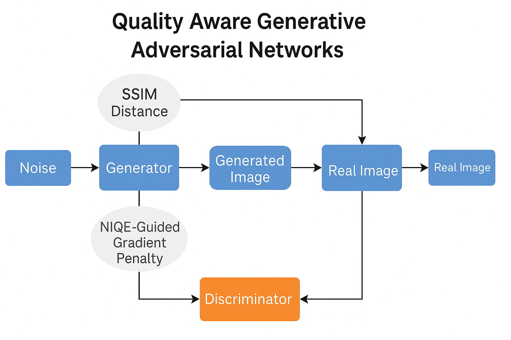
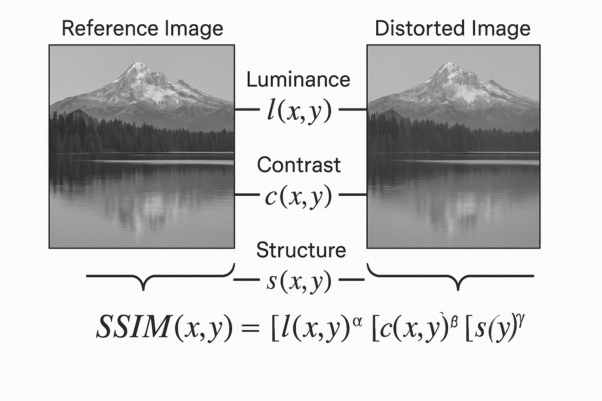

# Video Quality Assessment
### Learning Progress Report  
James Hsu  
June 13th 2025

---

## Learning Goals and Topics
- Why I’m Exploring the Use of IQA in GANs and Diffusion Models
  - Struggled to generate high-quality, condition-specific images (e.g., Cinnamoroll) using diffusion models
	- No-reference IQA is subjective, but offers a way to evaluate visual quality without ground truth
	- Curious if IQA can guide generation models to produce more perceptually aligned results
- Dataset
  - AIGIQA-20K: A Large Database for AI-Generated Image Quality Assessment [(link)](https://openaccess.thecvf.com/content/CVPR2024W/NTIRE/papers/Li_AIGIQA-20K_A_Large_Database_for_AI-Generated_Image_Quality_Assessment_CVPRW_2024_paper.pdf)
- IQA used in discriminator of GAN
  - Paper: Quality Aware Generative Adversarial Networks [(link)](https://arxiv.org/pdf/1911.03149)
- IQA used in diffusion
  - Paper: IQA-Adapter: Exploring Knowledge Transfer from Image Quality Assessment
  to Diffusion-based Generative Models [(link)](https://arxiv.org/pdf/2412.01794)

---

## Datasets for No-Reference IQA on AI-Generated Images

- Traditional IQA datasets focus on **distortion from real images**
- **AI-generated content (AIGC)** such as:
  - Diffusion models (e.g., Stable Diffusion)
  - GANs (e.g., StyleGAN)
  are **semantically plausible but may lack fidelity**
- Need dedicated datasets to evaluate AIGC quality **without reference images**

---

## Existing quality databases for AI-Generated Images/Videos

| Database       | Grain Size     | Images | Ratings  | Models | CFG    | Iteration | Resolution |
|----------------|----------------|--------|----------|--------|--------|-----------|------------|
| HPD            | Coarse-grained | 98,807 | 98,807   | 1      | Fixed  | Fixed     | Fixed      |
| ImageReward    | Coarse-grained | 136,892 | 136,892 | 3      | Fixed  | Fixed     | Dynamic    |
| Pick-A-Pic     | Coarse-grained | 500,000 | 500,000 | 6      | Fixed  | Fixed     | Dynamic    |
| AGIQA-1K       | Fine-grained   | 1,080  | 23,760   | 2      | Fixed  | Fixed     | Fixed      |
| AGIQA-3K       | Fine-grained   | 2,982  | 125,244  | 6      | Dynamic| Dynamic   | Fixed      |
| AIGCIQA        | Fine-grained   | 2,400  | 48,000   | 6      | Fixed  | Fixed     | Fixed      |
| AGIN           | Fine-grained   | 6,049  | 181,470  | 18     | Dynamic| Fixed     | Fixed      |
| AIGIQA-20K     | Fine-grained   | 20,000 | 420,000  | 15     | Dynamic| Dynamic   | Dynamic    |

---

## CFG: Classifier-Free Guidance Scale

- **Definition**:  
  A key parameter in Stable Diffusion and similar models that adjusts how closely the output image follows the input **prompt**.

- **Lower CFG**:
  - More diverse images  
  - Less adherence to the prompt

- **Higher CFG**:
  - Images align more strictly with the prompt  
  - Risk of artifacts or over-constrained outputs

---

## Dataset: AGIQA-1k

### [GitHub: AGIQA-1k](https://github.com/lcysyzxdxc/AGIQA-1k-Database)

- CVPR 2023 paper: [arXiv:2303.12618](https://arxiv.org/abs/2303.12618)
- **1,080 images** generated by:
  - Text-to-Image models: stable-inpaintingv1, stable-diffusion-v2
  - Hot keywords from the PNGIMG website for AGIs generation
- Each image is rated by **22 human annotators**
  - **MOS (Mean Opinion Score)**: For overall visual quality
- First dedicated **NR-IQA benchmark** for AI-generated images

---

## Dataset: DiffusionDB

### [DiffusionDB Website](https://poloclub.github.io/diffusiondb/)

- **2 million+** images generated by **Stable Diffusion**
- Each image paired with:
  - The **prompt** used to generate it
  - Model & inference parameters (guidance scale, steps, etc.)

### No built-in quality labels, but...

- We can:
  - Apply **existing IQA models** (e.g., AIGC-QA finetuned)
  - Collect user feedback to derive MOS
  - Use prompt-image pairs for training **semantic consistency models**

---

## IQA used in discriminator of GAN - QAGAN
- Quality Aware Generative Adversarial Networks (QAGAN)
- Motivation
  - Traditional GANs focus on fooling the discriminator, not perceptual quality.
  - IQA (Image Quality Assessment) metrics like SSIM and NIQE reflect human visual perception.
  - QAGAN uses these IQA metrics during training to guide high-quality image generation.
- Key Contributions
  - Introduced **SSIM Distance** into Generator loss  
  - Added **NIQE-Guided Gradient Penalty** in Discriminator  
  - Achieved improved visual quality and FID/IS scores

---

## QAGAN Architecture Overview

</img>

---

## SSIM: Structural Similarity Index

- **Goal**: Quantify how similar two images are based on human vision  
- **Formula**:  

$SSIM(x, y) = [l(x, y)]^\alpha \cdot [c(x, y)]^\beta \cdot [s(x, y)]^\gamma$

Where:  
- $( l(x, y) )$: Luminance (brightness similarity)  
- $( c(x, y) )$: Contrast similarity  
- $( s(x, y) )$: Structural similarity  

---

## SSIM Visual Example

### Reference vs. Distorted Image

</img>

- **Luminance**: Overall brightness consistency  
- **Contrast**: Local intensity variation  
- **Structure**: Texture and edge alignment  

→ SSIM combines these into a **single score** (closer to 1 means more similar)

---

## NIQE: Naturalness Image Quality Evaluator

- No-reference IQA metric: doesn’t need ground-truth
- Measures how "natural" an image looks statistically
- In QAGAN, NIQE is used to:
  - Apply **gradient penalty** in Discriminator
  - Push the Generator to produce more natural-looking images

---

## Inception Score (IS)

- Evaluates **image quality** and **diversity** based on classification confidence.

- **Formula**:
$IS = \exp \left( \mathbb{E}_{x} \left[ D_{KL}( p(y|x) \parallel p(y) ) \right] \right)$

- $( p(y|x) )$: predicted label distribution for generated image  
- $( p(y) )$: marginal class distribution across all generated images  
- High IS:
  - Clear, recognizable images (confident predictions)
  - Diverse class distribution

---

## Inception Score (IS)

- Interpretation:

| IS Score | Meaning                      |
|----------|------------------------------|
| ~11.2    | Real CIFAR-10 images         |
| ~6–8     | Good GAN-generated images    |
| ↑ Higher | Better quality & diversity   |

---

## Fréchet Inception Distance (FID)

- Measures **distribution similarity** between real and generated images  
  → Lower FID means closer to real data

- **Formula**:

$FID = \| \mu_r - \mu_g \|^2 + Tr( \Sigma_r + \Sigma_g - 2(\Sigma_r \Sigma_g)^{1/2} )$

- $( \mu_r, \Sigma_r )$: mean and covariance of real image features  
- $( \mu_g, \Sigma_g )$: mean and covariance of generated image features  
- Computed using **Inception-v3 feature activations**

---

## Fréchet Inception Distance (FID)
- Interpretation:

| FID Score | Meaning                       |
|-----------|-------------------------------|
| ~2        | Real images                   |
| 30–50     | GAN baseline (e.g., WGAN-GP)  |
| ~25.8     | QAGAN (improved quality)      |
| ↓ Lower   | Better visual fidelity        |

---

## Results Summary

| Metric            | WGAN-GP | QAGAN        |
|-------------------|---------|--------------|
| Inception Score ↑ | 6.23    | **7.10**     |
| FID ↓             | 43.5    | **25.8**     |

- Tested on: CIFAR-10, STL-10, CelebA
- Better quality and more stable training

---

## Training Details
- Base model: **WGAN-GP** architecture.
- Datasets used: **CIFAR‑10**, **STL‑10**, **CelebA**.
- Evaluation metrics: **Inception Score (IS)**, **FID**.

---

## Results
- Outperforms WGAN-GP and variants on IS and FID.
- Better human-perceived image quality.
- More stable training behavior observed.

---

## Summary & Insights

- **IQA plays a crucial role** in guiding perceptual quality of generated images, especially when ground-truth references are unavailable.
- **Datasets like AIGIQA-20K** provide a strong foundation to evaluate and train models for realistic, natural image generation.
- **QAGAN demonstrates** that integrating IQA into GAN training improves both objective scores (FID/IS) and subjective quality.
- **SSIM and NIQE** offer complementary perspectives:
  - SSIM: Structural similarity to reference images
  - NIQE: Naturalness without reference
- These principles may also be extended to **diffusion models** (e.g., IQA-Adapter) for further improving visual quality control.
- **Future direction**: Leverage IQA not only for evaluation, but also as **trainable feedback signals** for generative models.

---

## Thank You